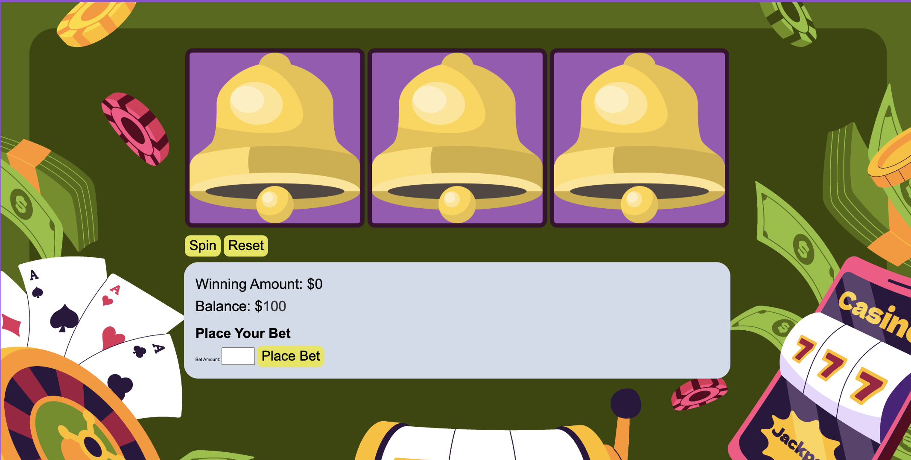
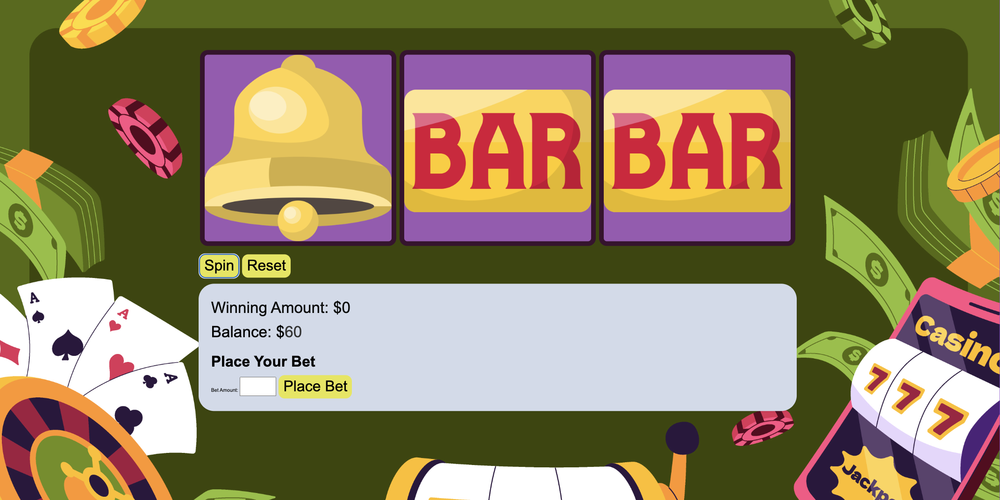

# Slot Machine Game

A simple browser-based slot machine game where players can place bets, spin the reels, and win prizes based on the symbol combinations.

## Table of Contents

- [Description]
  ## :computer: Technologies Used
  
  
  
  
  
  
  
  
- [Game Features](#game-features)
- [Installation](#installation)
- [Usage](#usage)

## ScreenShots

## Description

The Slot Machine Game is a basic web-based game that simulates a slot machine experience. Players can place bets, spin the reels, and have the chance to win based on predefined symbol combinations. The game is built using JavaScript, HTML, and CSS and provides a straightforward interface for interaction.

## Game Features

- **Place Bets:** Players can input their desired bet amount before spinning the reels.
- **Spin Reels:** Clicking the "Spin" button initiates the spinning animation of the reels.
- **Winning Combinations:** The game recognizes winning symbol combinations and calculates the corresponding prizes.
- **Win Popup:** When a player wins, a popup congratulating them on their victory appears.
- **Player Balance:** The player's balance is displayed, updating with each bet and win.

## Installation

1. Clone or download this repository to your local machine.
2. Open the `index.html` file in a web browser to play the game.

## Usage

1. Open the game in a web browser by launching the `index.html` file.
2. Enter your desired bet amount in the input field and click the "Place Bet" button.
3. Click the "Spin" button to start the spinning animation of the reels.
4. The reels will stop at random symbols after a short animation.
5. If you win, a popup will display the winning amount.
6. Your balance will be updated according to your wins and bets.
## getting started
Click here : https://mehdihouasse.github.io/Slot-Machine-Game/
